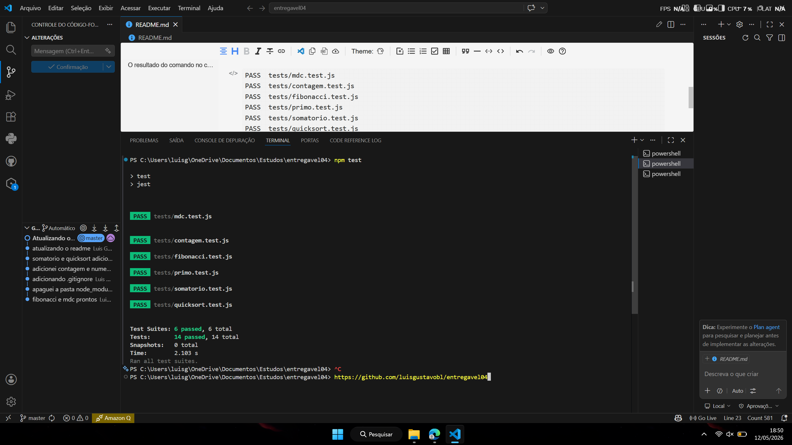

Para iniciar os testes primeiro utilize o comando: `npm install --save-dev jest`

*Isso irá instalar todos os módulos necessários para rodarmos os testes.*

Depois utilize o comando `npm test` para realizar os testes.


###### O resultado do comando no console deverá ser parecido com isso:

```
PASS  tests/mdc.test.js 
PASS  tests/contagem.test.js 
PASS  tests/fibonacci.test.js 
PASS  tests/primo.test.js 
PASS  tests/somatorio.test.js 
PASS  tests/quicksort.test.js

Test Suites: 6 passed, 6 total
Tests:       14 passed, 14 total
Snapshots:   0 total
Time:        2.103 s
```


